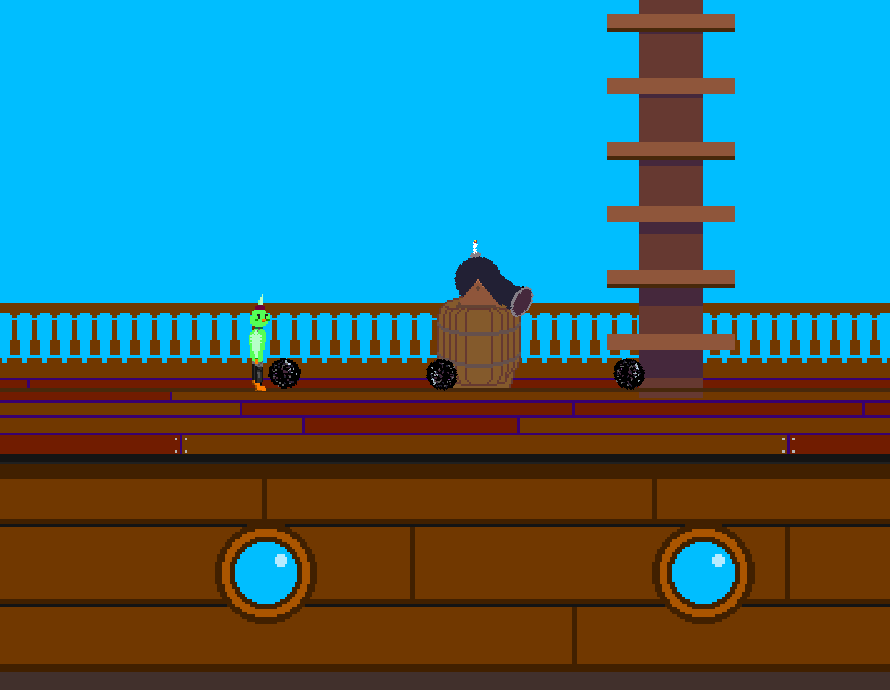

## DESCRIPTION
* A platformer game following Pari the parrot man, defender of... parrots.
* Contains a satisfying parrying mechanic.
* Uses C++, the SFML graphics library, and the Box2D physics engine
* General class hierarchy: `UserView <- GameController <- GameState <- View <- Model <- Actor`




## BUILD/RUN (from source)
Dependencies: make, cmake, gcc, sfml, box2d

### Linux
Arch/Manjaro:
```shell
sudo pacman -S cmake make gcc box2d sfml git
git clone https://github.com/GDC-WM/Parryt.git
mkdir Parryt/Debug
cd Parryt/Debug
cmake ..
make
./parryt
```

Other:
* Install make, cmake, gcc, SFML (libsfml-dev on Ubuntu) (and possibly SFML-dev), randr (xorg-dev and libglu1-mesa-dev on Ubuntu), doxygen, and git from your package manager (specific names depend on your distribution.
* Clone the repo with box2d submodule:

```
git clone --recursive https://github.com/GDC-WM/Parryt.git
```

* Build box2d:

```shell
mkdir Parryt/box2d/build
cd Parryt/box2d/build
cmake -DBOX2D_BUILD_DOCS=ON ..
cmake -build .
sudo cmake --build . --target install
cd ../../..
```

* Build/run Parryt:
```shell
mkdir Parryt/Debug
cd Parryt/Debug
cmake ..
make
./parryt
```


### MacOS
Install [Homebrew](https://brew.sh/) (a package manager), then follow our instructions for Linux.


### Windows
Use [this article](https://linuxconfig.org/install-manjaro-in-virtualbox) to install Manjaro Linux in a Virtual Machine, then follow our Manjaro build instructions.
